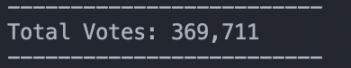
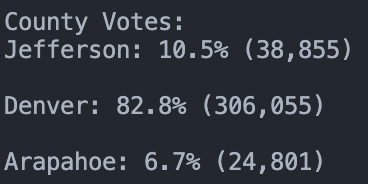
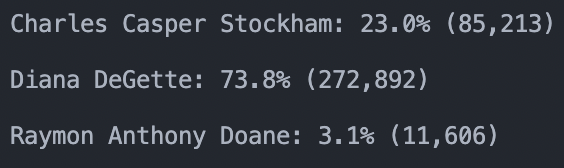
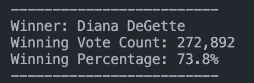

# School_District_Analysis
##Overview of Election Audit
The purpose of this election audit analysis was to provide an easy to understand report of the election data contained in election_results.csv. We aim to answer expected questions that are usually asked, like, who won? Or How many people voted? We provide that information in two ways: through printing to the terminal, or writing to a text file that can be sent to anyone who needs this information.

## Election-Audit Results: Using a bulleted list, address the following election outcomes. Use images or examples of your code as support where necessary.

-How many votes were cast in this congressional election?

-Provide a breakdown of the number of votes and the percentage of total votes for each county in the precinct.

-Which county had the largest number of votes?

-Provide a breakdown of the number of votes and the percentage of the total votes each candidate received.

-Which candidate won the election, what was their vote count, and what was their percentage of the total votes?

## Election-Audit Summary
The script I wrote can be very easily used for any election. We had a small dataset this time with only three columns, but say we were to get a bigger dataset next time. Printing a similar report for any extra columns would be a breeze, and means we would have room for more interesting data to play around with. Say that next time, we combine this report with who won for Vice President. It would take mere minutes for me to add a line in the Winners section listing that winner as well. The possibilities are limitless, perhaps next time we could display the whole executive board in this report! Additionally, formatting is also something we can easily tweak. Say we need this in a specific format, down to the exact number of spaces, new lines, and dashes - we can certainly do that, and it would take no time at all. It's pretty right now, but we could make it even more accessible and easy to understand by taking some extra steps to format it even better.
