# School District Analysis Report
## Overview of the School District Analysis
The purpose of this analysis was to analyze school and student data from the csvs which were cleaned and formatted into summary dataframes in a jupyter notebook python script. We summed up multiple statistics in an easy to read fashion, providing stats at a glance to our audience, the school officials. In this challenge, we were able to re-do the initial statistics to remove some shady data, the 9th graders from Thomas High School. This written report will explore the differences between our initial findings and the new version.

## Results
Screenshots will be listed as original, then new challenge versions. 

### How is the district summary affected?
###### Initial District Analysis
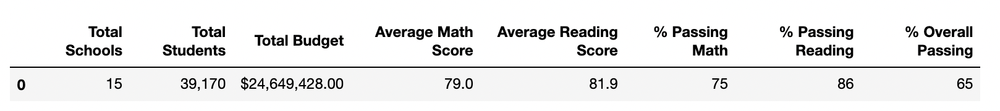

###### Challenge District Analysis
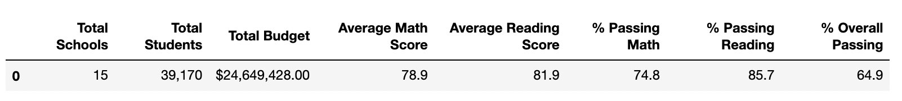

The new values affected the district analysis in very slight amounts, but there was a change nonetheless.
The district analysis is affected in the following ways:
- Average Math Score down % 0.1
- % Passing Math down % 0.2
- % Passing Reading down % 0.3
- % Overall Passing down % 0.1
Total Schools, Total Students, Total Budget, & Average Reading Score remained the same.

### How is the school summary affected?

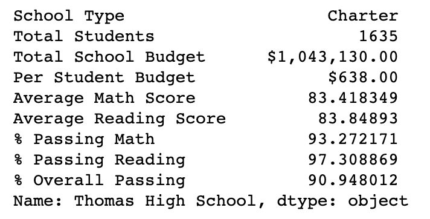 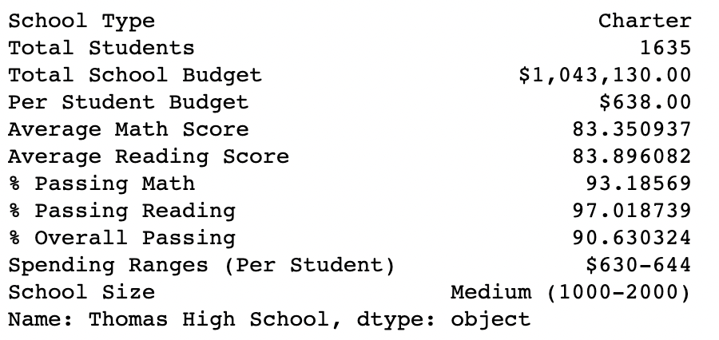
###### Top: Initial, Bottom: Challenge
The second analysis also only slightly affected the Schools numbers. Specifically, the only school affected was of course Thomas High School, and the changes are the following:
- Average Math Score down % 0.06
- Average Reading Score down % 0.05
- % Passing Math down % 0.05
- % Passing Reading down % 0.3
- % Overall Passing down % 0.3
Total Students, Total School Budget, and Per Student Budget remained the same.

### How does replacing the ninth graders’ math and reading scores affect Thomas High School’s performance relative to the other schools?
Replacing the ninth graders’ math and reading scores does not affect Thomas HS' standing amongst the other schools. They still remain the second strongest performer in % Overall Passing (see below for highest earning high schools)

###### Initial Thomas HS Comparative Analysis: % Overall Passing
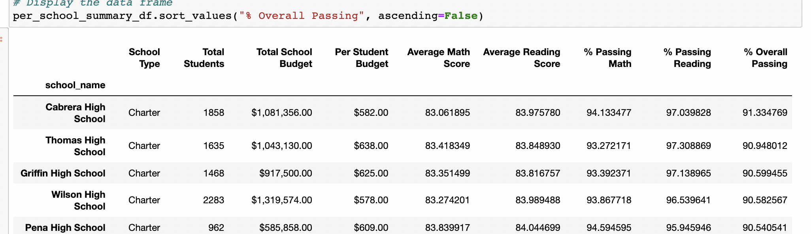

###### Challenge Thomas HS Comparative Analysis: % Overall Passing
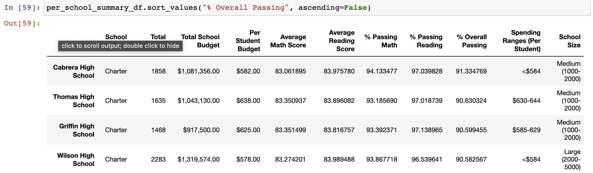

### How does replacing the ninth-grade scores affect the following:
### Math and reading scores by grade
For Thomas High School, they remain in the top half for math scores in every grade, despite the new analysis. The only notable difference is that the new 9th Grade columns in both reading and math score dataframes are now filled with NaNs.

###### Initial Math Scores (sorted by 12th grade, descending)
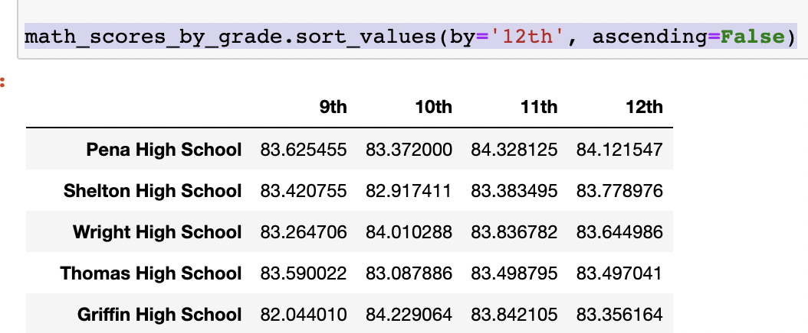

###### Challenge Math Scores (sorted by 12th grade, descending)
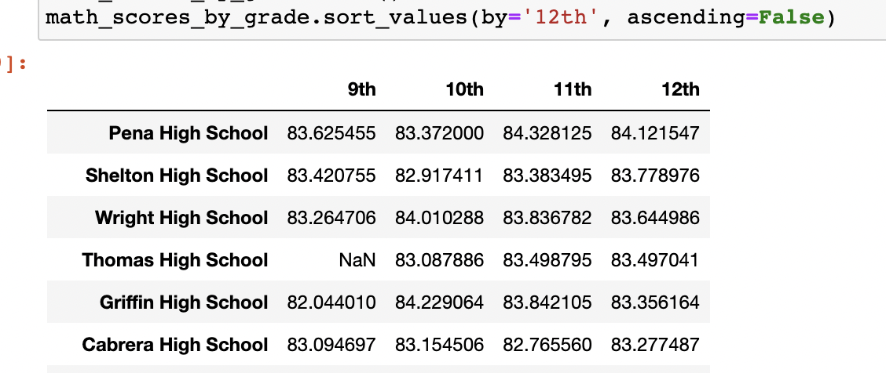

Thomas High School is unfortunately in the bottom half for reading scores, and this doesn't change from our initial to our challenge analysis. Again, note the 9th Grade NaNs.

###### Initial Math Scores (sorted by 12th grade, descending)
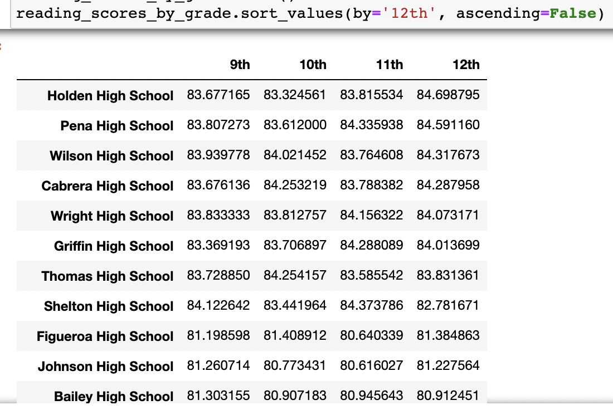

###### Challenge Math Scores (sorted by 12th grade, descending)
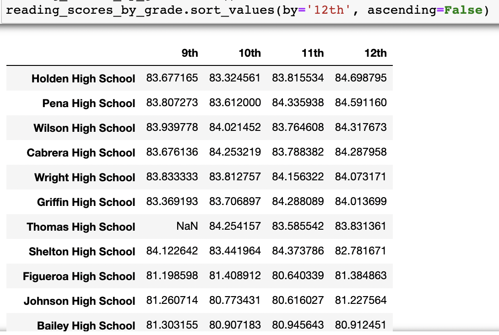

### Scores by school spending
Scores seem to be unaffected by school spending in either case. The $630 to 644 tier is very slightly affected by Thomas High School's changes, since that is its bin. The scores vary in change amount from about .01 to .1 of a percent. 

###### Initial Scores by Spending
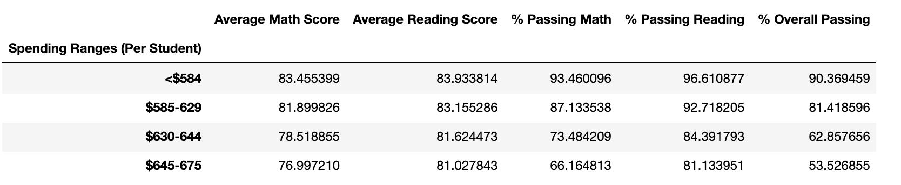

###### Challenge Scores by Spending

### Scores by school size
Scores by school size seem to be completely unaffected by the change to our analysis.

###### Initial Scores by School Size
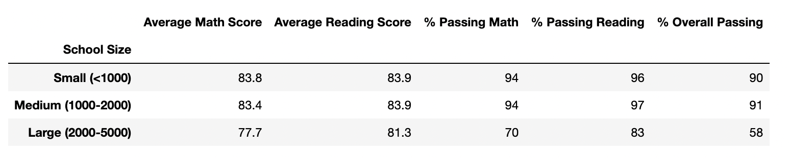

###### Challenge Scores by School Size
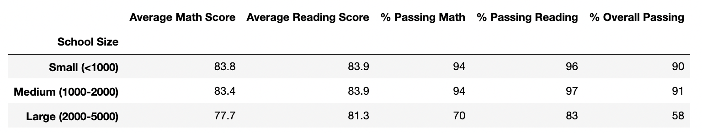

### Scores by school type
Similiarly, this metric - scores affected by school size - did not change.

###### Initial Scores by School Type
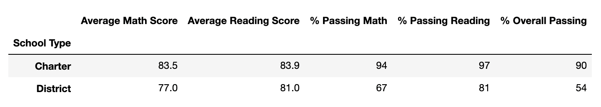

###### Challenge Scores by School Type
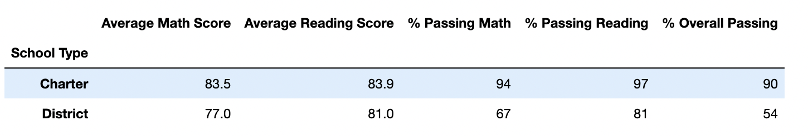

## Summary
Summarize four changes in the updated school district analysis after reading and math scores for the ninth grade at Thomas High School have been replaced with NaNs.
In conclusion, the changes to our data - replacing reading and math scores for the ninth grade at Thomas High School with NaNs - are as follows:
1. Thomas High School had overall good grades, so removing them brings the average down in most categories.
2. Thomas High School performed especially good in Math, where removing the 9th graders' grades brought down the Average Score by % 0.1!
3. The Passing % was also negatively affected by the changes, as the percentage decreased by % 0.2.
4. Curiously, even though the Average Reading Score did not decrease with the new NaNs, but % Passing Reading did - by % 0.3! 

It's clear that the school district will miss this data, as including it would bring their averages up, and that's how districts keep their funding. However, academic dishonesty is a real threat, and with high scores like this, they're doing the right thing by auditing if they have a good suspicion.